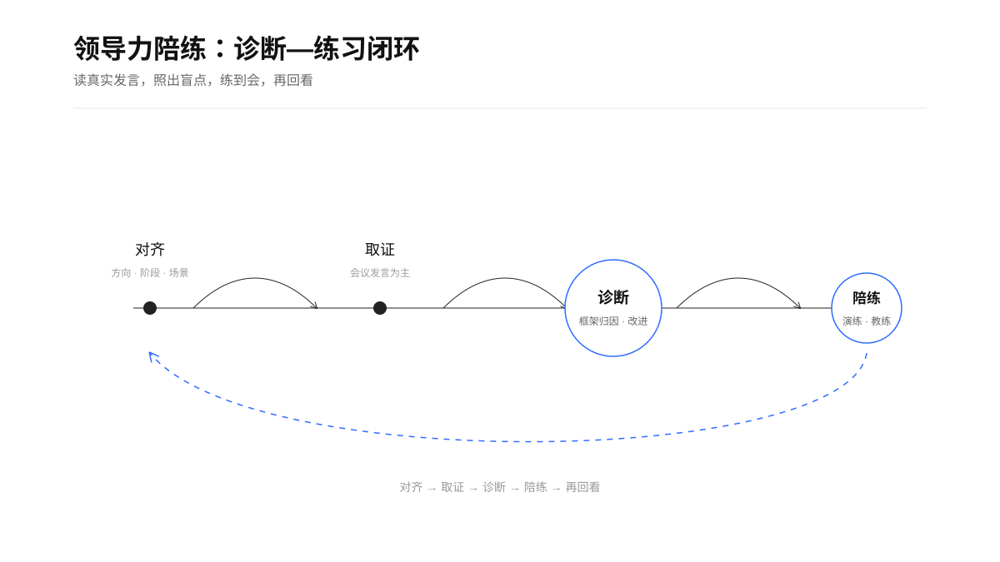
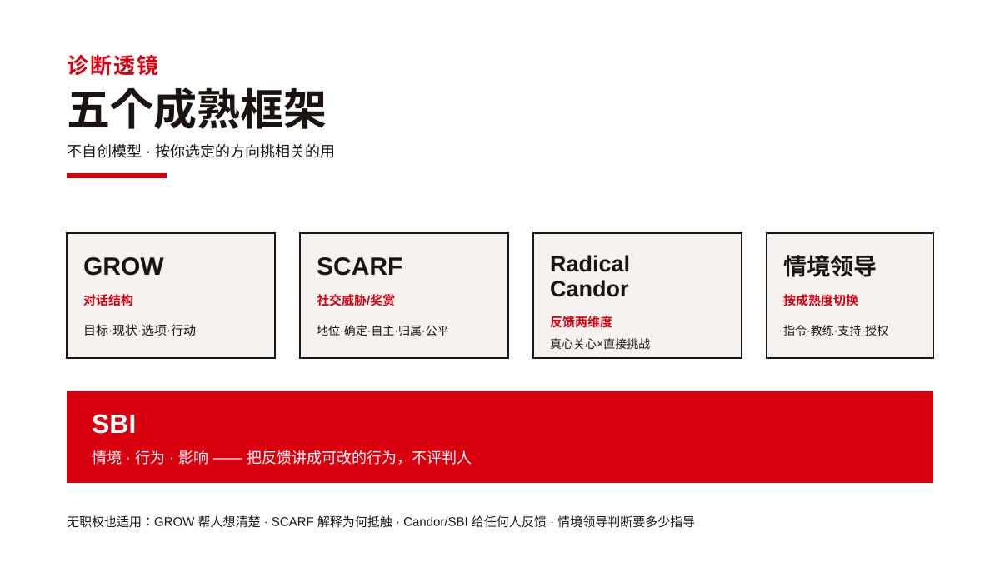
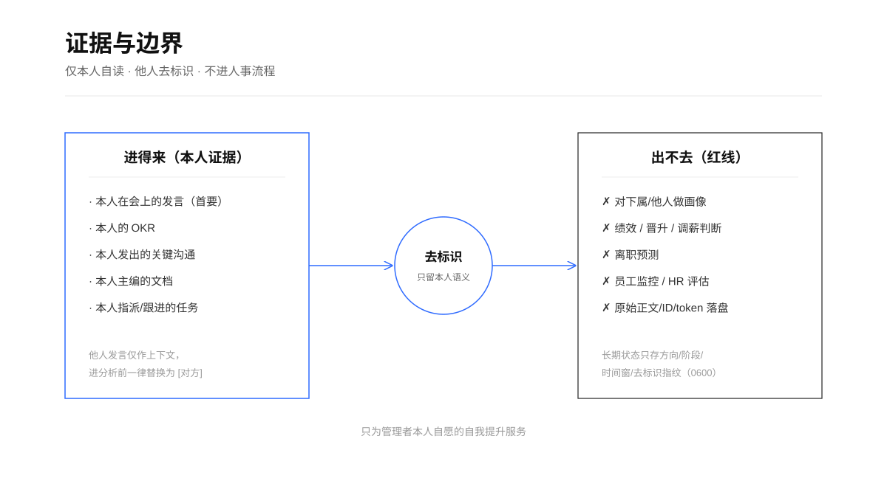

<blockquote>
"We all need people who will give us feedback. That's how we improve."<br/>
—— Bill Gates, TED 2013《Teachers need real feedback》
</blockquote>

# 领导力陪练 · Leadership Coach

<p align="center">
  
  
  
  
  
</p>

**读你在会上的真实发言，照出领导力盲点，陪你练到会。**

一个面向**任何想变得更有影响力的人**的私密 AI 领导力陪练——不只是管理者，也包括还没有下属的普通员工/个人贡献者。领导力不等于职级：无正式职权时，它体现在你怎么向上沟通、怎么推动跨部门协作、怎么在会上表达和说服、怎么给同事反馈、怎么带着人把事做成。它不靠自评问卷，而是读你**本人真实的工作证据**——尤其是周会等重要会议上你自己的发言逐字记录——用成熟的领导力框架照出你的盲点，给出能马上用的改进动作，然后陪你把薄弱项练到会。

它还能**定期自动复盘**：默认每周一上午 10:30，复盘你上一周的领导力表现，并对比"上次最该改的一件事"有没有改善。

Agent 无关：任何能跑 `lark-cli` 和 Python 3.9+ 的宿主（TRAE / Claude Code / Codex / Cursor 等）都可用。

<p align="center">
  
</p>

## 它和现成方案的区别

调研过的现成方案要么只做**陪练**（如 bettersense 的 coaching-mode、cci-ai-bot 的角色扮演），要么只做**通信元数据分析**（Worklytics / Viva Insights 等 ONA 工具）。**没有人把三件事打通**：读真实工作证据的**语义内容** → 用成熟框架诊断领导力 → 基于诊断做陪练。本 skill 的护城河，是能读到别人读不到的**内容级**证据（本人会议发言原话），而不是靠问卷或元数据。

## 为什么值得用｜核心价值

1. **基于真实证据，不凭空臆测**——抓取飞书里你本人真实的会议逐字、OKR、关键沟通、文档作为分析对象，结论都挂得到原始出处，而不是套模板讲正确的废话。
2. **看到"这种情况怎么处理更好"**——同样的工作场景里，从你共同参与的会议中提炼同类情境下更好的处理方式、真实做法和原话，**全程脱敏、不点名**，翻译成你能直接模仿的动作。你要的是体感，不是知道谁做的——去掉姓名也避免同事间攀比。
3. **定期自动复盘**——默认每周一 10:30 自动抓取过去一周的领导力表现，做增量诊断，并对比"上次最该改的一件事"是否改善，让提升成为习惯而非一次性。
4. **多框架交叉诊断**——同一段发言用 GROW / SCARF / Radical Candor / 情境领导 / SBI 多个成熟透镜同时照，避免"一把锤子看什么都是钉子"的单一模型偏差。
5. **证据分级、可追溯**——每条结论标注「事实 / 本人已表达 / 观察 / 待验证推断」，清楚区分"数据说的"和"我推断的"，不把猜测当结论。
6. **不止诊断，还陪练到会**——诊断 → 情景演练（AI 扮难搞的对方）/ GROW 拉底式教练 → 再诊断的闭环，把"知道问题"变成"练成肌肉记忆"。
7. **隐私优先、仅本人自读**——他人发言去标识、结论只回本人、不进绩效/晋升/离职等人事流程、长期状态最小化，这是它敢碰真实会议数据的信任基础。
8. **受众泛化：领导力=影响力**——不只管理者，没有下属的个人贡献者也能练向上沟通、跨部门推动、会议说服。

## 核心特色：从真实发言反推领导力问题

会议逐字记录里你自己的发言，是你影响风格最真实、最高密度的证据——比零散消息更能看出你怎么设目标、怎么给反馈、怎么处理不同意见、是给结论还是提问题、能不能推动没有汇报关系的人。skill 会：

1. 定位你的周会 / 评审 / 项目会；
2. 只抽出**你自己的发言轮次**（他人一律去标识为 `[对方]`）；
3. 用 GROW / SCARF / Radical Candor / 情境领导 / SBI 照出问题；
4. 每条结论都挂**真实发言证据 + 框架归因 + 可落地动作**。

它还能帮你看到**"这种情况怎么处理更好"**：针对你薄弱的方向，从你们一起开过的会里，提炼同类情境下更好的**处理方式和真实场景**，翻译成你下次能直接试的动作——**全程脱敏、不点名**，只学做法不比人（见 `references/role-model.md`）。

> 领导力 = 影响力。有下属就代入"下属/团队"，没下属就代入"协作方/跨部门伙伴/上级/项目里被你带的人"——诊断只看你本人的行为，不因你有没有下属而改变。

## 五阶段流程

```
阶段0 身份与边界闸门
阶段1 开场多轮对齐   —— 先说清想练什么方向、当前什么阶段、哪个真实场景（定期复盘模式跳过）
阶段2 建立领导力工作地图（先给你确认）—— 会议发言为首要证据源
阶段3 领导力诊断（核心特色）
阶段3.5 情境范本（可选）—— 从共同会议提炼同类情境更好的处理方式（脱敏不点名）
阶段4 陪练（可选）—— 情景演练 / GROW 拉底式教练
```

两种运行模式：**首次/按需**走完整对齐；**定期复盘**（默认周一 10:30）跳过对齐，只诊断上一周新增证据并对比趋势，见 `references/periodic-review.md`。

## 挂载的成熟框架

不自创模型，全部引成熟体系：GROW（教练对话结构）、SCARF（社交威胁/奖赏）、Radical Candor（反馈两维度）、情境领导（按成熟度切换风格）、SBI（反馈表达结构）。定义与来源见 `references/frameworks.md`。

<p align="center">
  
</p>

## 快速开始

```bash
# 1. 只读健康检查（验证身份与可用证据源）
python3 scripts/doctor.py --live

# 2. 初始化私有状态（首次；--weekday 可选，默认 mon）
python3 scripts/state.py init --report-time 10:30 --timezone Asia/Shanghai --weekday mon

# 3. 记录本次教练契约（阶段1对齐后）
python3 scripts/state.py set-intent --direction "跨部门推动" --stage "个人贡献者" --scene-tag "跨部门争取资源未果" --confirm

# 4. 从会议逐字记录抽取本人发言（他人自动去标识）
#    lark-cli 的逐字稿是纯文本文件，先转 JSON 再抽取：
cat ./minutes/<token>/transcript.txt \
  | python3 scripts/transcript_to_json.py \
  | python3 scripts/extract_speaker_turns.py --me "你的显示名" --me-id "ou_xxx"
```

然后对宿主 agent 说"用领导力陪练帮我复盘一下最近的表现"，它会按 `SKILL.md` 走完流程。要每周自动复盘，就用宿主的定时/自动化能力，在周一 10:30 触发同一句话。

## 隐私

- **仅本人自读、自愿自助**：只处理当前登录用户本人的数据，结论只回本人。
- 会议里他人发言只用于还原上下文，进入分析前一律去标识。
- 长期状态（默认 `~/.leadership-coach/state.json`，可用 `LEADERSHIP_COACH_STATE_PATH` 覆盖，`0600`）只存提升方向、阶段、时间窗、去标识指纹；任何原始 ID / 正文 / token 落盘都是 schema 违规。
- **不用于**员工监控、HR 绩效评估、晋升/调薪/离职决策、招聘、教育测评或对任何第三方的画像。

<p align="center">
  
</p>

详见 `references/privacy.md`。

## 目录

| 路径 | 作用 |
|---|---|
| `SKILL.md` | 入口：边界 + 五阶段流程 + 路由 |
| `references/intake-dialogue.md` | 开场多轮对齐问诊脚本 |
| `references/collection-playbook.md` | 各证据源的 lark-cli 取证命令与实测坑 |
| `references/frameworks.md` | 五个领导力框架的诊断信号与改进方向 |
| `references/diagnosis-rubric.md` | 诊断卡、评分口径、证据分级 |
| `references/role-model.md` | 情境范本：从共同会议提炼同类情境更好处理（脱敏不点名） |
| `references/reading-list.md` | 方向对口的经典书推荐（关键节点点一本） |
| `references/sparring.md` | 情景演练 + GROW 拉底式教练机制 |
| `references/periodic-review.md` | 每周定期复盘的排期与增量逻辑 |
| `references/privacy.md` | 隐私与威胁边界 |
| `references/output-template.md` | 诊断报告成品模板 |
| `scripts/doctor.py` | 只读健康检查 |
| `scripts/lark_identity_probe.py` | 只读身份探针（带 profile 兼容回退） |
| `scripts/transcript_to_json.py` | 纯文本逐字稿 → 说话人 JSON（接 extract） |
| `scripts/extract_speaker_turns.py` | 从逐字记录抽本人发言、去标识他人 |
| `scripts/state.py` | 隐私最小化私有状态 |

## License

MIT
